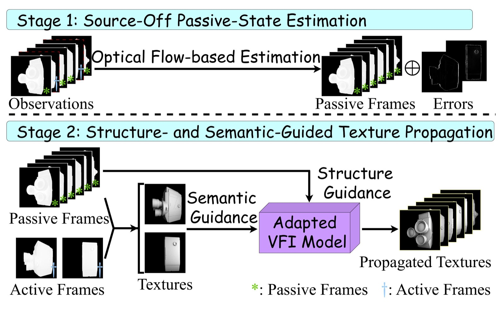
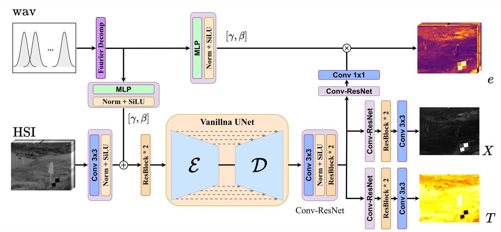
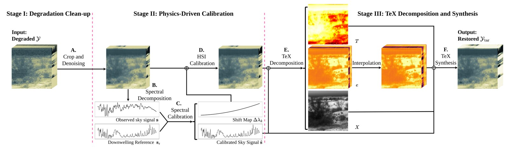

<h1 align="center">
  Hi 👋, I'm Cheng Dai
</h1>

  

<h3 align="center">
  <i>"Beyond appearance, toward physical vision."</i>
</h3>

### 🧬 About Me
- 🎓 I am working on **thermal infrared hyperspectral imaging**, **HADAR-based physical vision**, and **efficient AI systems**.
- 🔬 My current research focuses on **temperature-emissivity-texture decomposition**, physically interpretable thermal perception, and lightweight deployment for practical sensing systems.
- 🎯 I am actively seeking **27 Fall PhD opportunities**!
- 🌐 Visit my **[Personal Website](https://dccc2025.github.io/)** for academic information, or check the **[website repository](https://github.com/dccc2025/dccc2025.github.io)** for the source.

### 📝 Research Highlights

<table>
  <tr>
    <td width="30%">
      
    </td>
    <td width="70%">
      <h4>🧩 <a href="https://arxiv.org/abs/2608.02192">T2exture: Sparsely Perturbed Thermal-to-Texture Imaging</a></h4>
      

        <em>Jiashuo Chen†, <b>Cheng Dai</b>†, Yanan Hu, and Fanglin Bao</em>
         
        † Equal contribution; authors are listed alphabetically.
      

      

        A sparsely perturbed <b>thermal-to-texture imaging framework</b> that reconstructs temporally dense thermal-texture sequences from passive LWIR frames and a few actively perturbed keyframes.
      

      

        <a href="https://arxiv.org/abs/2608.02192">[Paper]</a> &nbsp;
        <a href="https://github.com/dccc2025/T2exture">[Code]</a> &nbsp;
        <a href="https://huggingface.co/datasets/chenjiashuo/T2exture_datasets">[Dataset]</a> &nbsp;
        <a href="https://huggingface.co/chenjiashuo/T2exture_model">[Model Weights]</a>
      

    </td>
  </tr>
</table>

<table>
  <tr>
    <td width="30%">
      
    </td>
    <td width="70%">
      <h4>🌡️ <a href="https://github.com/dccc2025/TeX-1500">TeX-1500: A Paired Real-World LWIR Hyperspectral Dataset and Benchmark</a></h4>
      

        <em><b>Cheng Dai</b>*, Jiale Lin*, Hongyi Xu, Bingxuan Song, Ziyang Xie, and Fanglin Bao</em>
         
        * Equal contribution.
         
        
        
        
      

      

        A paired real-world long-wave infrared hyperspectral dataset and benchmark for supervised <b>temperature-emissivity-texture decomposition</b>, together with TeX-UNet as a wavelength-aware baseline.
      

      

        <a href="https://arxiv.org/abs/2606.03806">[Paper]</a> &nbsp;
        <a href="https://github.com/dccc2025/TeX-1500">[Code]</a> &nbsp;
        <a href="https://huggingface.co/datasets/jialelin2007/TeX-1500">[Dataset]</a> &nbsp;
        <a href="https://huggingface.co/dccc2025/TeX-UNet">[Model Weights]</a>
      

    </td>
  </tr>
</table>

<table>
  <tr>
    <td width="30%">
      
    </td>
    <td width="70%">
      <h4>🛠️ <a href="https://github.com/jialelin2007/HAIR">HAIR: HADAR-Based Thermal Infrared Hyperspectral Image Restoration</a></h4>
      

        <em><b>Cheng Dai</b>*, Jiale Lin*, Bingxuan Song, Yifei Chen, Jiashuo Chen, Xin Yuan, and Fanglin Bao</em>
         
        * Equal contribution.
         
        
        
      

      

        A <b>physics-driven restoration framework</b> for ground-based thermal-infrared hyperspectral images, combining HADAR rendering with spectral calibration and TeX decompose-synthesize restoration.
      

      

        <a href="https://arxiv.org/abs/2605.13664">[Paper]</a> &nbsp;
        <a href="https://github.com/jialelin2007/HAIR">[Code]</a>
      

    </td>
  </tr>
</table>

---

### 🌍 Connect with Me
- Email: [daicheng@westlake.edu.cn](mailto:daicheng@westlake.edu.cn)
- LinkedIn: [Cheng Dai](https://www.linkedin.com/in/cheng-dai-443432403/) -- Welcome to connect with me!
- Personal Website: [dccc2025.github.io](https://dccc2025.github.io/)
- Google Scholar: [Cheng Dai](https://scholar.google.com/citations?hl=zh-CN&user=vJrsT54AAAAJ)
- **Always open to research collaborations and exciting side-projects! Welcome to contact me!**

---

### ✨ Just for Fun

> I want everyone in the future to work on HADAR! ✊😎🪛

---

<!---
dccc2025/dccc2025 is a ✨ special ✨ repository because its `README.md` appears on the GitHub profile.
--->
